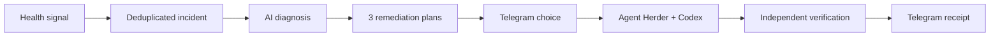

# NoticePlace

[Русский](README.ru.md) · [中文](README.zh.md) · [Docs](docs/)


> Your agents keep working. You get the decision and the result in Telegram.

NoticePlace turns failures and long agent jobs into one visible flow: detect → diagnose → offer three plans → let a human choose → run Codex through Agent Herder → verify independently → report the outcome.



- Host CPU, RAM, disk, failed services, logs and keywords
- Durable incidents, deduplication, retries and trace IDs
- Human choice with signed Telegram buttons
- Codex, OpenCode, Hermes and GPTAdmin agent jobs
- Useful-progress supervision, not heartbeat-only checks
- Independent verification before resolution
- Telegram, Matrix calls, Android calls and extensible delivery adapters
- AskHuman MCP, producer SDKs and protected operator console

## Install

```bash
codex mcp add notify -- npx -y github:megamen32/noticeplace
```

See the [complete feature list](docs/features.md), [production deployment](deploy/README.md), [producer API](docs/producer.md), and [agent jobs](docs/gptadmin-agent-jobs.md).

MIT
