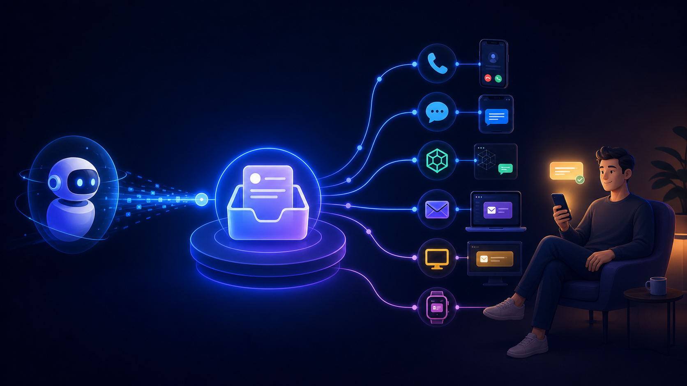

# NoticePlace

[English](README.md) · **Русский** · [中文](README.zh.md) · [Документация](docs/)



> Universal Outbox для AI-to-human attention.

AI продолжает работу, пока NoticePlace доставляет важное через звонок, чат,
сообщение, email или другой настроенный канал. Для обратного потока и входящих
сообщений используется отдельный [Universal Inbox](https://github.com/megamen32/universal-inbox).

## Установка

```bash
codex mcp add notify -- npx -y github:megamen32/noticeplace
```

Для маленького SSH/process watcher используйте отдельный публичный проект
[Notify](https://github.com/megamen32/notify) — маленький CLI и AI skill.

## Быстрый старт

1. Создайте project-scoped token в защищённой админке.
2. Отправьте событие на `POST /v1/events`.
3. Настройте topics, adapters и live escalation в `/admin/`.

Подробнее: [API](docs/notification-center-mvp.md), [админка](docs/admin.md),
[SDK](docs/producer-sdk.md), [MCP](docs/mcp.ru.md).
