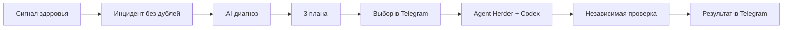

# NoticePlace

[English](README.md) · [中文](README.zh.md) · [Документация](docs/)


> Агенты продолжают работать. Решение и результат приходят вам в Telegram.

NoticePlace превращает сбои и долгие агентские задачи в один понятный поток: обнаружить → диагностировать → предложить три плана → получить выбор человека → запустить Codex через Agent Herder → независимо проверить → сообщить результат.



- CPU, RAM, диск, failed services, логи и ключевые слова
- Инциденты, дедупликация, повторы и trace ID
- Подписанные кнопки выбора в Telegram
- Codex, OpenCode, Hermes и GPTAdmin jobs
- Supervisor полезного прогресса, а не heartbeat
- Закрытие только после независимой проверки
- Telegram, Matrix-звонки, Android-звонки и расширяемые адаптеры
- AskHuman MCP, SDK продюсера и защищённая админка

## Установка

```bash
codex mcp add notify -- npx -y github:megamen32/noticeplace
```

[Все функции](docs/features.md) · [Production deploy](deploy/README.md) · [API](docs/producer.md) · [Agent jobs](docs/gptadmin-agent-jobs.md)

MIT
