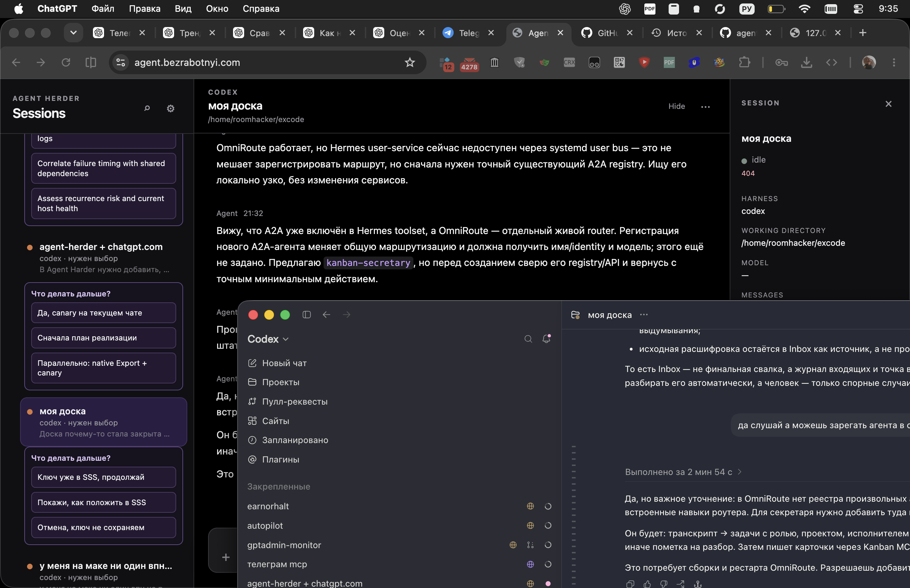

# NoticePlace features

## Health incident automation

- Fleet signals for CPU, RAM, disk, SSH availability and failed systemd units.
- Log severity and configurable keyword detection outside service logs.
- Stable fingerprints, deduplicated incidents and occurrence counters.
- Read-only diagnosis followed by exactly three remediation plans.
- Signed Telegram plan buttons with visible selected-state confirmation.
- Agent Herder sessions for Codex, OpenCode and Hermes, including stable session IDs.
- Useful-progress supervision based on changed steps and evidence, not process heartbeat alone.
- Durable retries, idempotency, elapsed time, evidence refs and trace refs.
- Independent source verification; an agent's terminal response cannot resolve an incident by itself.
- Healthy resolution or honest degraded outcome delivered back to Telegram.

## Human attention and delivery

- Telegram topics, inline actions, acknowledgement, snooze and questions.
- AskHuman MCP for notifications, questions and two/three-way choices.
- Matrix and Android escalation calls for critical incidents.
- Configurable severity routing, quiet hours, repeats and escalation deadlines.
- Extensible channel adapters for messages, chats, email and calls.

## Agent jobs

- Allowlisted GPTAdmin jobs with signed requests and bounded telemetry.
- Direct Agent Herder remediation path for long Codex turns.
- Codex, OpenCode and Hermes harness support.
- Durable job identity, progress receipts, terminal receipts and correlation IDs.
- User-controlled remediation selection; no silent plan substitution.

## Platform

- SQLite-backed events, incidents, deliveries, audits and human requests.
- Project-scoped producer tokens with maximum-severity limits.
- Python and Node.js producer SDKs with optional wait for acknowledgement or resolution.
- Protected operator console for producer scopes, Telegram routes and policies.
- Managed install, immutable releases, upgrade, rollback and uninstall lifecycle.

## Real production flow

The current production canary detected a degraded host log signal, sent three Russian plans to the Telegram `Health` topic, recorded the operator's choice, launched Codex through Agent Herder, verified nginx/Xray endpoints independently and sent the degraded outcome back to Telegram. The incident remained open because the original source signal was still degraded.

Detailed guides: [producer API](producer.md), [SDK](producer-sdk.md), [AskHuman](human-request.md), [agent jobs](gptadmin-agent-jobs.md), [admin](admin.md), and [deployment](../deploy/README.md).
